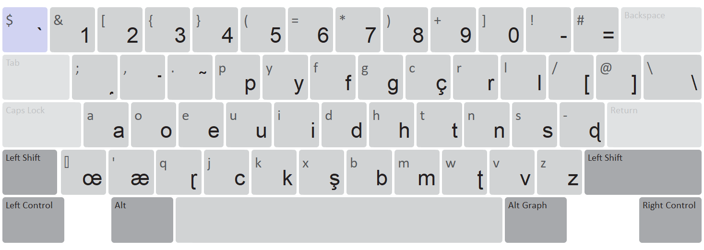
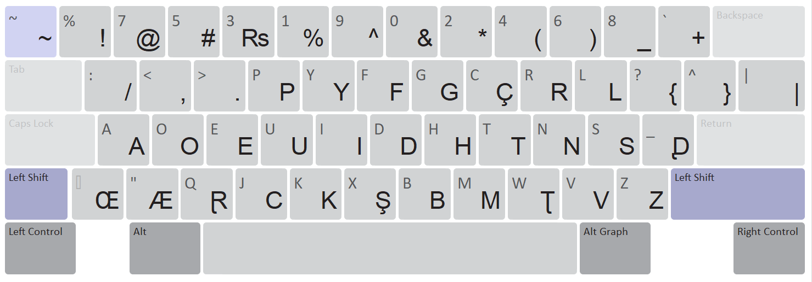
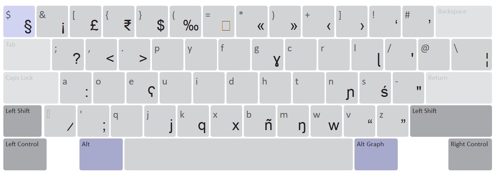
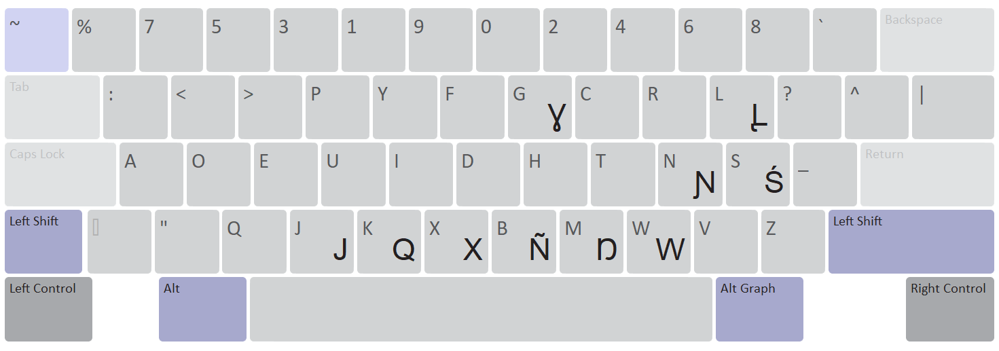
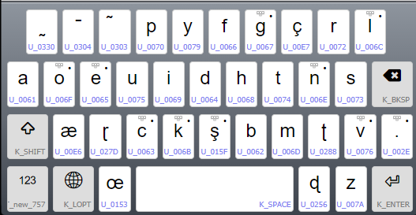
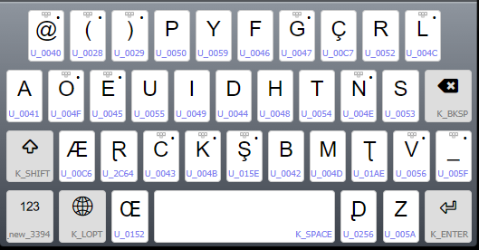
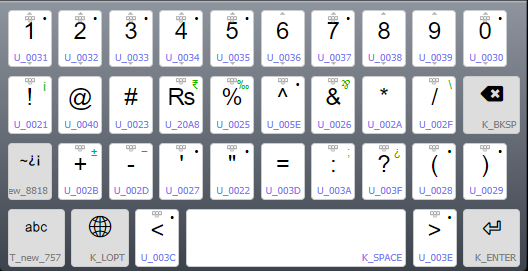
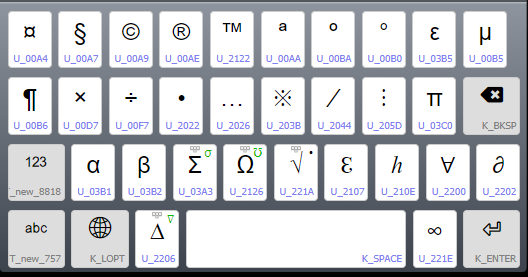

Why I Made This System

Learning Urdu’s Arabic script or Hindi's Devanagari script is tough—especially sounds like retroflex ṭ/ḍ (ٹ/ڈ), nasalization, and aspiration. Most Latin Urdu (like Barah Khadi) doesn’t show these clearly.

## Typing Guide

## Desktop Keyboard Layout

## Mobile Desktop Layout

This System Fixes That:

    Uses IPA symbols for tricky sounds (e.g., ʈ for ٹ, ɖ for ڈ).

    Marks aspiration (p̃ = پھ, k̃ = کھ).

    Shows nasalization (a̰ = اں).

Example:

"Mere xāyal mḛ, yḛ ãc̃ā nāī xai."

(میرے خیال میں، یہ اچھا نہیں ہے۔)

(मेरी राय में, यह अच्छा नहीं है.)

Who’s It For?

    Urdu learners struggling with pronunciation.

    Linguists who want precise transcription.

    Tech users who need ASCII-friendly Urdu.

